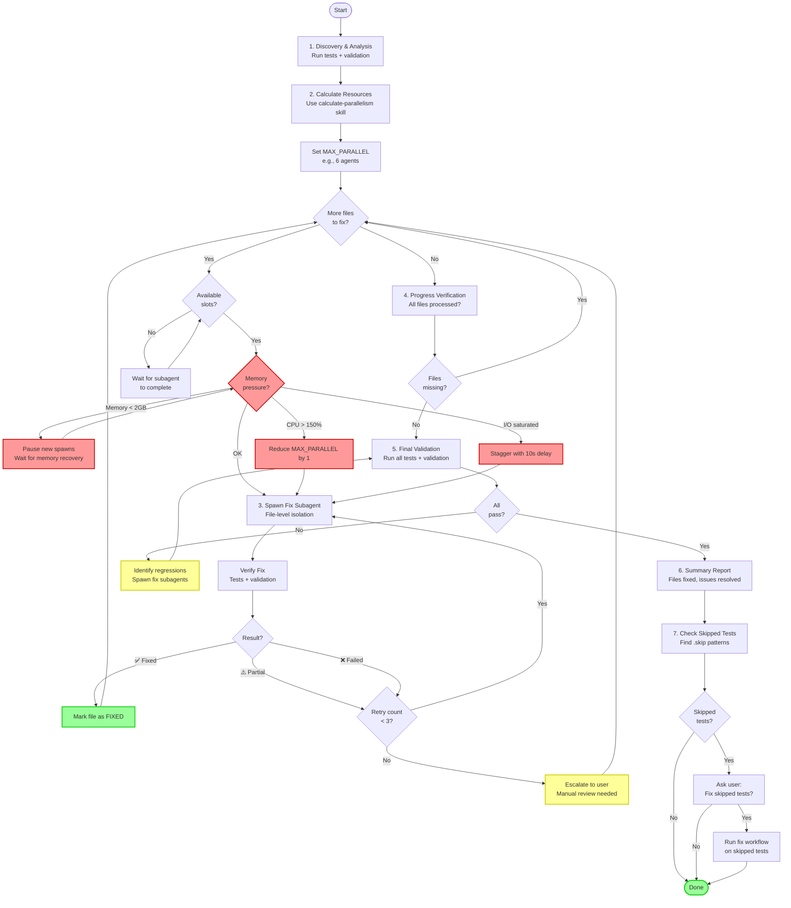

# Fix Unit Tests

Systematically fix test failures using parallel subagents with intelligent coordination, resource-aware execution, file-level isolation, and iterative verification.

**Scope**: This skill supports multiple test frameworks:
- **Unit Tests**: Vitest, Jest (JavaScript/TypeScript)
- **E2E Tests**: Playwright (browser-based end-to-end testing)
- **Server-Side Tests**: .NET Test (NUnit, xUnit, MSTest for C#)

The skill automatically detects which test framework is in use and adapts its behavior accordingly.

## Test Environment Detection

**CRITICAL**: Before running any commands, detect the test environment using the provided script:

```bash
# Auto-detect test framework and available tools
node scripts/detect-test-environment.mjs
```

This script:
- Automatically detects the test framework (Vitest, Playwright, .NET Test, etc.)
- Identifies the project root directory
- Detects available validation tools (prettier, eslint, typescript, dotnet format, etc.)
- Outputs JSON with detection results including framework-specific configuration

**All subsequent commands run from the detected project root and use framework-appropriate commands and tools.**

### Supported Frameworks

#### Vitest/Jest (JavaScript/TypeScript Unit Tests)
- **Detection**: Looks for `vitest`, `jest`, or `vite` in package.json
- **Test Command**: `pnpm/npm/yarn exec vitest run`
- **Validation**: prettier (optional), eslint, tsc
- **File Patterns**: `**/*.test.ts`, `**/*.spec.ts`, `**/*.test.tsx`, `**/*.spec.tsx`
- **Resource Usage**: ~2GB per worker

#### Playwright (E2E Tests)
- **Detection**: Looks for `@playwright/test` in package.json or `playwright.config.ts`
- **Test Command**: `npx playwright test`
- **Validation**: prettier (optional), eslint, tsc
- **File Patterns**: `**/*.spec.ts`, `e2e/**/*.test.ts`
- **Resource Usage**: ~5GB per worker (includes browser instances)
- **Special Considerations**:
  - Higher resource usage due to browser instances
  - More prone to flakiness (network, timing)
  - May have shared state concerns (database, ports)
  - Reduced parallelism to avoid conflicts

#### .NET Test (NUnit/xUnit/MSTest)
- **Detection**: Looks for `Microsoft.NET.Test.Sdk`, `NUnit3`, `xunit`, or `MSTest` in .csproj files
- **Test Command**: `dotnet test <project>.csproj`
- **Validation**: `dotnet format`, `dotnet build`
- **File Patterns**: `**/*Test.cs`, `**/*Tests.cs`
- **Resource Usage**: ~3GB per worker

### Running Validation

Use the provided script to run validation based on available tools:

```bash
# Run validation for entire project (cross-platform)
node scripts/run-validation.mjs

# Run validation for single file
node scripts/run-validation.mjs src/path/to/file.tsx
```

The script automatically runs prettier (if available), eslint, and tsc. Works on Windows, macOS, and Linux.

## When to Activate

- Tests are failing (unit, E2E, or server-side)
- Multiple test files need fixes simultaneously
- Type/compilation errors are blocking test execution
- Lint/format errors are causing test failures
- After major refactoring or dependency updates
- Before committing changes (pre-commit cleanup)
- Test validation errors need systematic fixing

## Core Workflow

> **Note**: The flowchart below uses Mermaid syntax. To view it in VSCode, install the **"Markdown Preview Mermaid Support"** extension from the Extensions marketplace. The diagram will render correctly on GitHub and other markdown viewers that support Mermaid.



**Key Points:**
- **Memory pressure checks** happen before each subagent spawn (red nodes)
- **Adaptive throttling** reduces MAX_PARALLEL dynamically during execution
- **Iterative verification** ensures each file is truly fixed (max 3 retries)
- **Progress tracking** prevents incomplete work
- **Final validation** catches regressions before completion

### 1. Discovery & Analysis

**CRITICAL**: Run BOTH test execution AND validation to discover all issues using the provided script:

```bash
# Auto-detects test framework and runs appropriate commands
node scripts/run-discovery.mjs
```

This script:
1. **Auto-detects** the test framework (Vitest, Playwright, .NET Test)
2. **Runs tests** using framework-appropriate command and saves output to `test-output.txt`
   - Vitest: `vitest run --config vitest.config.ts`
   - Playwright: `npx playwright test --reporter=list`
   - .NET: `dotnet test <project>.csproj --no-build`
3. **Runs validation** using available tools and saves output to `validate-output.txt`
   - JavaScript/TypeScript: prettier (optional), eslint, tsc
   - .NET: dotnet format, dotnet build
4. **Reports** exit codes for both checks
5. **Exits** with non-zero if either check failed

The skill parses both outputs to extract framework-specific issues:

**For JavaScript/TypeScript (Vitest/Playwright):**
- Test failures (file, test name, error message, assertions)
- Type errors (file, line, TypeScript issues)
- Lint errors (file, line, ESLint violations)
- Format issues (prettier inconsistencies)

**For .NET:**
- Test failures (test name, assertion messages)
- Build errors (file, line, compiler errors)
- Format violations (dotnet format issues)

Issues are grouped by filename and sorted by count (fix high-impact files first):

```
file-a.test.tsx: 15 issues (8 test failures, 5 type errors, 2 lint)
file-b.tsx: 12 issues (0 test failures, 10 type errors, 2 lint)
UserServiceTests.cs: 8 issues (5 test failures, 3 build errors)
```

**Why both commands?**
- Test execution finds runtime failures and assertion errors
- Validation finds compile-time errors, type issues, lint violations, format issues
- **Both must pass** for tests to be truly fixed

### 2. Resource-Aware Parallelism Calculation

**CRITICAL**: Before spawning subagents, calculate optimal parallelism based on **available resources** and **test framework**.

Use the **calculate-parallelism** skill to determine MAX_PARALLEL value.

This skill automatically:
- Detects available memory and CPU cores
- Checks current system load
- Calculates safe parallelism limits (minimum 2, maximum 6)
- Applies coordination overhead caps
- Provides detailed resource analysis

**Framework-Specific Resource Requirements:**

The skill automatically adjusts memory requirements based on detected test framework:

- **Vitest/Jest (Unit Tests)**: **2GB per subagent**
  - Standard unit test execution
  - Type-checking + linting + test execution
  - Typical for JavaScript/TypeScript unit tests

- **Playwright (E2E Tests)**: **5GB per subagent**
  - Browser instances (~200-300MB each)
  - Test execution context (~200MB)
  - Screenshots/videos/traces (variable)
  - **More conservative parallelism** to avoid resource exhaustion
  - **Stagger spawns** by 5 seconds to avoid port conflicts

- **.NET Test (Server Tests)**: **3GB per subagent**
  - Test project loading (~500MB)
  - Test execution (~1-2GB)
  - Compilation and type-checking overhead

Test fixing is memory-intensive as it involves: source files + test files + type-checking + validation + test execution.

Consult the **calculate-parallelism** skill documentation for usage instructions, algorithm details, and configuration options.

### 3. Parallel File Fixing

**CRITICAL**: Process ALL files with errors, not just the first one!

#### Parallelization Strategy

1. **Get list of ALL files** with errors from step 1 (parse-validate-output.mjs)
2. **Calculate MAX_PARALLEL** using the calculate-parallelism skill
3. **Spawn subagents in batches**:
   - Batch 1: Spawn MIN(MAX_PARALLEL, total_files) subagents immediately
   - As subagents complete, spawn next file in queue
   - Continue until ALL files are processed
4. **Track completion**: Maintain list of fixed files vs remaining files
5. **Verify progress**: After each batch, check how many files remain

**Example**: If you have 12 files with errors and MAX_PARALLEL=4:
- Batch 1: Spawn subagents for files 1-4 (in parallel)
- File 1 completes → Spawn subagent for file 5
- File 3 completes → Spawn subagent for file 6
- Continue until all 12 files are processed

**DO NOT**: Stop after fixing the first file or first batch!

#### Spawn Fix Subagent (for EACH file)

```
Task: Fix all issues in {filename}

Context:
- File path: {relative_path_to_file} (relative to project root)
- Test Framework: {detected_framework} (Vitest/Playwright/.NET Test)
- Issues (from test/validation output):
  • Test failure: "expected X to be Y"
  • Type/Build error: Property 'foo' does not exist (or compilation error for .NET)
  • Lint: unused variable 'bar'

Requirements:
- Fix ALL issues in this file only
- Do NOT modify other files
- Follow project coding standards (check CLAUDE.md if available)
- Maintain test coverage (don't delete tests)
- Use framework-appropriate syntax and patterns

Success Criteria:
- All test failures resolved
- Zero type/compilation errors
- Zero lint errors
- Tests pass when run in isolation
```

#### Verify Fix (File-Level)

**CRITICAL**: Verify BOTH test execution AND validation using the provided script:

```bash
# Auto-detects framework and runs appropriate verification
node scripts/verify-fix.mjs {relative_path_to_file}

# Get JSON output for programmatic use
node scripts/verify-fix.mjs {relative_path_to_file} --json

# Specify project directory if needed
node scripts/verify-fix.mjs {relative_path_to_file} --directory /path/to/project
```

This script:
- **Auto-detects** the test framework
- **Runs tests** for the file (if it's a test file) using framework-appropriate command
- **Runs validation** using available tools (framework-specific)
- **Reports** combined results
- **Exits** with 0 if all checks passed, 1 if errors remain

The script adapts to the detected framework:
- **Vitest/Jest**: Runs `vitest {file} --run`, prettier, eslint, tsc
- **Playwright**: Runs `npx playwright test {file} --workers=1`, prettier, eslint, tsc
- **.NET**: Runs `dotnet test --filter {className}`, dotnet format, dotnet build

#### Evaluate Result

- **Success** (zero errors in BOTH): ✅ Mark file as FIXED, move to next
- **Partial** (fewer errors): Send back to subagent with remaining issues
- **Failed** (same/more errors): Send back with detailed failure analysis

**File is only "fixed" when:**
- All tests pass (no test failures)
- No type errors
- No lint errors
- No format issues

#### Iteration Limit

- Max 3 rounds per file
- After 3 failed attempts, escalate to user for manual review

### 4. Progress Verification

**CRITICAL**: Before moving to final validation, verify ALL files were processed using the provided script:

```bash
# Verify progress (requires initial-files-list.txt and fixed-files-list.txt)
node scripts/verify-progress.mjs initial-files-list.txt fixed-files-list.txt
```

This script:
- Compares initial file count with fixed file count
- Reports progress percentage
- Lists remaining files if any were not processed
- Exits with 0 if all files processed, 1 if files remain

**If files remain**:
- Identify why they weren't processed (timeout? error? skipped?)
- Spawn subagents for remaining files
- Do NOT proceed to final validation until ALL files attempted

### 5. Final Validation

After **ALL** files processed, run complete validation using the provided script:

```bash
# Run from frontend directory
node scripts/run-final-validation.mjs
```

This script:
- Runs ALL unit tests (`vitest run`)
- Builds and runs full validation (format + lint + type-check)
- Reports results for both checks
- Exits with 0 if all pass, 1 if failures remain

Expected results:
- **All tests passing** (100% pass rate)
- **Zero type errors**
- **Zero lint errors**
- **Zero format issues**

If issues remain:
- Identify regressed files (compare test output to initial)
- Spawn targeted fix subagents
- Repeat validation (max 2 regression cycles)

### 5. Summary Report

```markdown
## Unit Test Fix Summary

### Files Fixed: 12/15
✅ file-a.test.tsx (15 issues → 0)
✅ file-b.tsx (12 issues → 0)
✅ file-c.test.tsx (3 issues → 0)

### Files Requiring Manual Review: 3/15
⚠️ file-x.test.tsx (8 issues - complex mocking)
⚠️ file-y.tsx (2 type errors - circular dependency)

### Final Validation
- Total issues: 45 → 0
- Test pass rate: 72% → 100%
- Type errors: 28 → 0
- Lint errors: 17 → 0

### Verification
✅ `vitest run` - All tests passing
✅ `prettier + eslint + tsc` - Zero errors/warnings

### Skipped Tests Detected
⏭️ 3 skipped tests found (see below for details)

### Next Steps
- Review skipped tests
- Code review (optional)
- Commit changes
```

**If skipped tests are found, append this to the summary**:

```markdown
---

## 🔍 Skipped Tests Found

I found **3 skipped tests** in the codebase:

1. **src/components/Auth.test.tsx:42** - `describe.skip` - Auth flow tests
2. **src/utils/validation.test.tsx:156** - `it.skip` - Edge case validation
3. **src/features/checkout.test.tsx:203** - `test.skip` - Stripe integration

These tests were likely skipped due to:
- Known issues or bugs
- Missing test infrastructure
- External dependencies (APIs, services)
- Complex scenarios requiring refactoring

**Would you like me to attempt to fix and re-enable these skipped tests using the same workflow?**

I will:
- Investigate why each test was skipped
- Fix underlying issues (mocking, dependencies, assertions)
- Re-enable tests (remove .skip)
- Verify they pass in isolation
- Run full test suite to ensure no regressions
```

### 6. Skipped Tests Analysis

**CRITICAL**: After all errors are fixed and validation passes, check for skipped tests.

#### Detect Skipped Tests

Use the provided script to search for and generate a structured summary of skipped tests:

```bash
# Run from frontend directory
# Generate skipped tests summary
node scripts/find-skipped-tests.mjs

# Get JSON output for programmatic use
node scripts/find-skipped-tests.mjs --json
```

**Output**:
```
━━━━━━━━━━━━━━━━━━━━━━━━━━━━━━━━━━━━━━━━━━━━━━━━━━━━
🔍 Skipped Tests Summary
━━━━━━━━━━━━━━━━━━━━━━━━━━━━━━━━━━━━━━━━━━━━━━━━━━━━
src/components/Auth.test.tsx:42       describe.skip - Auth flow tests
src/utils/validation.test.tsx:156     it.skip - Edge case validation
src/features/checkout.test.tsx:203    test.skip - Stripe integration
━━━━━━━━━━━━━━━━━━━━━━━━━━━━━━━━━━━━━━━━━━━━━━━━━━━━
Total: 3 skipped tests found
━━━━━━━━━━━━━━━━━━━━━━━━━━━━━━━━━━━━━━━━━━━━━━━━━━━━
```

#### Ask User About Skipped Tests

If skipped tests are found, present this summary and ask:

```markdown
## Skipped Tests Found

I found **3 skipped tests** in the codebase:

1. **src/components/Auth.test.tsx:42** - `describe.skip` - Auth flow tests
2. **src/utils/validation.test.tsx:156** - `it.skip` - Edge case validation
3. **src/features/checkout.test.tsx:203** - `test.skip` - Stripe integration

These tests were likely skipped due to:
- Known issues or bugs
- Missing test infrastructure
- External dependencies (APIs, services)
- Complex scenarios requiring refactoring

**Would you like me to attempt to fix and re-enable these skipped tests using the same workflow?**

I will:
- Investigate why each test was skipped
- Fix underlying issues (mocking, dependencies, assertions)
- Re-enable tests (remove .skip)
- Verify they pass in isolation
- Run full test suite to ensure no regressions
```

#### If User Confirms

Run the same fix-unit-tests workflow targeting only the skipped test files:

1. **Extract Skipped Test Files**: Get unique list of files containing skipped tests
2. **Calculate Resources**: Use the calculate-parallelism skill
3. **Spawn Fix Subagents**: One per file, with specific instructions:
   ```
   Task: Fix and re-enable skipped tests in {filename}

   Context:
   - File path: src/{filename} (relative to frontend directory)
   - Skipped tests:
     • Line 42: describe.skip - Auth flow tests
     • Line 156: it.skip - Edge case validation

   Requirements:
   - Investigate WHY each test was skipped (check comments, git history)
   - Fix underlying issues (mocking, API calls, assertions)
   - Remove .skip to re-enable test
   - Ensure test passes in isolation
   - Do NOT skip verification step
   - If test CANNOT be fixed, document reason in code comment

   Success Criteria:
   - All skipped tests either:
     a) Re-enabled and passing, OR
     b) Left skipped with clear comment explaining why
   ```
4. **Verify Each Fix**: Run `pnpm exec vitest {filename}` after each fix
5. **Final Validation**: Run `pnpm test:unit` to ensure no regressions
6. **Report Results**: Show which tests were successfully re-enabled vs still skipped

## Resource-Aware Execution

### Key Constraints

- **Never exceed MAX_PARALLEL** concurrent subagents
- **Queue remaining files** if MAX_PARALLEL is reached
- **Monitor resource usage** during execution:
  - If memory drops below 2GB: pause new spawns
  - If CPU load spikes >150% of cores: reduce MAX_PARALLEL by 1
  - If disk I/O saturated: stagger launches with 10s delay
- **Adaptive throttling** - reduce parallelism mid-execution if resources become constrained

### Dynamic Adjustment Example

```
Initial: MAX_PARALLEL=6 (24GB available, 8 cores, load 2)
After batch 1: Memory dropped to 8GB → reduce to MAX_PARALLEL=2
After batch 2: Memory recovered to 16GB → increase to MAX_PARALLEL=5
```

## Command Patterns

### File-Level Validation

Use the provided scripts for consistent validation:

```bash
# Verify a fix (runs tests + validation for a file)
node scripts/verify-fix.mjs src/path/to/file.tsx

# Run validation for single file
node scripts/run-validation.mjs src/path/to/file.tsx
```

### Test Execution

```bash
# Run specific test file (run from frontend directory)
pnpm exec vitest src/path/to/file.test.tsx

# Run specific test by line number (fastest)
pnpm exec vitest src/path/to/file.test.tsx:42
```

### Full Validation

```bash
# Run complete discovery (tests + validation)
node scripts/run-discovery.mjs

# Run final validation after all fixes
node scripts/run-final-validation.mjs
```

## Subagent Requirements

Each fix subagent MUST:

1. **Read Context**:
   - Source file being tested
   - Test file with failures
   - Related components/utilities (if imports indicate dependencies)

2. **Apply Project Standards**:
   - Check CLAUDE.md or project docs for specific coding standards
   - Common best practices:
     - Immutability (no mutations, use spread operators)
     - Modern React patterns (hooks, functional components)
     - No console.log statements in production code
     - No unused imports/variables
     - Proper TypeScript types (no `any` unless necessary)

3. **Fix Systematically**:
   - Fix test failures first (highest priority)
   - Fix type errors next
   - Fix lint errors last
   - Run validation after each fix category

4. **Verify Locally**:
   - Run prettier, eslint, and tsc on the file before reporting completion
   - Include validation output in completion report

5. **Report Status**:
   - Issues fixed (by type: test/type/lint)
   - Issues remaining (if any)
   - Validation output
   - Any blockers or uncertainties

## Common Issue Patterns

### Test Failures

#### Async Test Handling

```typescript
// ❌ WRONG (missing await)
it('should fetch data', () => {
  const result = fetchData()  // Promise not awaited
  expect(result).toBe('data')
})

// ✅ CORRECT
it('should fetch data', async () => {
  const result = await fetchData()
  expect(result).toBe('data')
})
```

#### React Testing Library

```typescript
// ❌ WRONG (not waiting for async updates)
render(<Component />)
expect(screen.getByText('loaded')).toBeInTheDocument()

// ✅ CORRECT
render(<Component />)
await waitFor(() => {
  expect(screen.getByText('loaded')).toBeInTheDocument()
})
```

### Type Errors

#### Mock Type Mismatches

```typescript
// ❌ WRONG (mock doesn't match real function signature)
vi.mock('./api', () => ({
  fetchUser: vi.fn(() => ({ name: 'test' }))  // Missing 'id' field
}))

// ✅ CORRECT (mock matches actual type)
vi.mock('./api', () => ({
  fetchUser: vi.fn((): User => ({ id: 1, name: 'test' }))
}))
```

#### Test Fixture Types

```typescript
// ❌ WRONG (untyped test data)
const testUser = { name: 'John' }  // Incomplete/incorrect type

// ✅ CORRECT (properly typed test fixtures)
const testUser: User = {
  id: 1,
  name: 'John',
  email: 'john@example.com'
}
```

### Lint Errors

#### Unused Variables

```typescript
// ❌ WRONG (unused import/variable)
import { useState, useEffect } from 'react'

function Component() {
  const [count, setCount] = useState(0)
  return <div>Hello</div>  // count never used
}

// ✅ CORRECT (remove unused)
function Component() {
  return <div>Hello</div>
}
```

#### var Usage

```typescript
// ❌ WRONG (var is prohibited)
var count = 5

// ✅ CORRECT (use const/let)
const count = 5
```

## Error Handling

### Subagent Timeout
- **Trigger**: Subagent exceeds 5 minutes without progress
- **Action**: Kill subagent, log state, move to next file
- **Recovery**: Retry file at end of queue (once)

### Persistent Failures
- **Trigger**: File fails 3 times with same issues
- **Action**: Mark for manual review, continue with other files
- **Report**: Include failure details in final summary

### Regression Detected
- **Trigger**: Full validation shows new errors in previously fixed files
- **Action**: Identify regressed files, spawn targeted fix subagents
- **Limit**: Max 2 regression fix cycles (prevent infinite loops)

### Memory Exhaustion
- **Trigger**: System memory >90% during execution
- **Action**: Wait for current subagents to finish, reduce MAX_PARALLEL by 1
- **Recovery**: Resume queue with lower parallelism

## Workflow Integration

### Before Running

- Ensure backend is built (types may need regeneration)
- Commit any working changes (create restore point)
- Check for conflicting branches/PRs

### After Running

- Review fixed files (spot check for quality)
- Run full test suite: `pnpm exec vitest run --config vitest.config.ts` (from frontend directory)
- Run E2E tests if critical flows affected
- Commit fixes: `git commit -m "fix: resolve unit test failures"`
- Use code review skill to verify code quality

## Best Practices

### DO

- ✅ Run full validation (prettier + eslint + tsc) before starting (baseline)
- ✅ Calculate MAX_PARALLEL based on available resources
- ✅ **Process ALL files** in the error list (not just first file!)
- ✅ Fix files in priority order (most issues first)
- ✅ Spawn subagents in parallel (up to MAX_PARALLEL)
- ✅ Track which files are fixed vs remaining
- ✅ Verify each file individually before moving on
- ✅ Run full validation at the end
- ✅ Generate comprehensive summary report

### DON'T

- ❌ **Stop after fixing just ONE file** (process ALL files!)
- ❌ Spawn unlimited subagents (respect memory limits)
- ❌ Skip file-level verification (leads to regressions)
- ❌ Delete tests to "fix" failures (maintain coverage)
- ❌ Modify multiple files per subagent (hard to verify)
- ❌ Proceed if full validation fails at end

### Common Mistakes to Avoid

**MISTAKE #1**: Only fixing the first file and stopping
```bash
# WRONG: Only processes first file
fix_file "file1.test.tsx"
echo "Done!"  # ❌ What about files 2-12?

# CORRECT: Process ALL files
for file in "${all_error_files[@]}"; do
    fix_file "$file"
done
```

**MISTAKE #2**: Not tracking progress
```bash
# WRONG: No visibility into what's been processed
# User has no idea if all files were attempted

# CORRECT: Track and report progress
echo "Processing file 3 of 12: $file"
echo "Fixed: 2, Failed: 0, Remaining: 10"
```

## File Isolation Benefits

Each subagent works on ONE file only to:
- Enable precise verification (format + lint + type-check per file)
- Avoid cross-file conflicts
- Simplify rollback if subagent fails
- Maximize parallelism (no file dependencies)

## Success Definition

Skill succeeds when **BOTH** of these pass (framework-specific):

**For Vitest/Jest:**
1. **Test Execution**: `vitest run` - All tests passing (100% pass rate)
2. **Validation**: `prettier + eslint + tsc` - Zero type errors, zero lint errors, zero format issues

**For Playwright:**
1. **Test Execution**: `npx playwright test` - All E2E tests passing
2. **Validation**: `prettier + eslint + tsc` - Zero type errors, zero lint errors, zero format issues

**For .NET Test:**
1. **Test Execution**: `dotnet test` - All tests passing (100% pass rate)
2. **Validation**: `dotnet format + dotnet build` - Zero compilation errors, zero format violations

**Both checks must be green** for the skill to report success.

### Post-Success Workflow

After both checks pass, the skill **MUST** check for skipped tests:

1. Run `node scripts/find-skipped-tests.mjs` to identify skipped tests
2. If skipped tests are found:
   - Present summary with file paths, line numbers, and descriptions
   - Ask user: "Would you like me to fix and re-enable these skipped tests?"
3. If user confirms:
   - Apply same fix-unit-tests workflow to skipped test files
   - Investigate why tests were skipped
   - Fix underlying issues and remove `.skip`
   - Verify tests pass in isolation
   - Run full test suite to ensure no regressions
4. If no skipped tests found:
   - Report success and recommend commit

## Dependencies

### calculate-parallelism Skill

This skill uses the **[calculate-parallelism](/.claude/skills/calculate-parallelism/SKILL.md)** skill to determine optimal parallelism for spawning subagents.

See the calculate-parallelism skill documentation for:
- Full algorithm explanation
- Resource constraint details
- Platform support
- Example calculations

## Supporting Scripts

The skill includes colocated helper scripts in `scripts/`:

### `detect-test-environment.mjs`
Auto-detects the test framework and project configuration.

**Usage**:
```bash
# Auto-detect test framework, project root, and available tools
node scripts/detect-test-environment.mjs [directory]
```

**Output** (JSON to stdout):
```json
{
  "framework": "vitest",
  "displayName": "Vitest",
  "testType": "unit",
  "projectRoot": "/absolute/path/to/project",
  "config": {
    "packageManager": "pnpm",
    "hasPrettier": true,
    "vitestConfig": "vitest.config.ts"
  }
}
```

Diagnostic messages are sent to stderr. Script exits with 1 if no test framework can be detected.

**Supported Frameworks**:
- Vitest/Jest (JavaScript/TypeScript unit tests)
- Playwright (E2E tests)
- .NET Test (NUnit/xUnit/MSTest)

### `run-validation.mjs`
Runs framework-appropriate validation. Cross-platform.

**Usage**:
```bash
# Run validation for entire project (auto-detects framework)
node scripts/run-validation.mjs

# Run validation for single file
node scripts/run-validation.mjs src/path/to/file.tsx

# Specify project directory
node scripts/run-validation.mjs src/file.tsx /path/to/project
```

**Exit codes**:
- `0` - All validation passed
- `1` - Validation failed
- `2` - No test environment detected

### `run-discovery.mjs`
Runs discovery phase: test execution + validation. Auto-detects framework.

**Usage**:
```bash
# Run from any directory (auto-detects test framework and project root)
node scripts/run-discovery.mjs [directory]
```

**What it does**:
1. Auto-detects test framework (Vitest/Playwright/.NET Test)
2. Runs framework-appropriate test command and saves output to `test-output.txt`
   - Vitest: `pnpm exec vitest run --config vitest.config.ts`
   - Playwright: `npx playwright test --reporter=list`
   - .NET: `dotnet test <project>.csproj --no-build`
3. Runs framework-appropriate validation and saves output to `validate-output.txt`
4. Reports exit codes for both checks

**Exit codes**:
- `0` - Both checks passed
- `1` - One or both checks failed
- `2` - No test environment detected

### `verify-progress.mjs`
Verifies all files have been processed by comparing initial and fixed file lists.

**Usage**:
```bash
node scripts/verify-progress.mjs initial-files-list.txt fixed-files-list.txt
```

**What it does**:
1. Compares initial file count with fixed file count
2. Reports progress percentage
3. Lists remaining files if any were not processed

**Exit codes**:
- `0` - All files processed
- `1` - Some files remain unprocessed
- `2` - Invalid usage

### `run-final-validation.mjs`
Runs final validation: all tests + full validation. Auto-detects framework.

**Usage**:
```bash
# Run from any directory (auto-detects framework)
node scripts/run-final-validation.mjs
```

**What it does**:
1. Auto-detects test framework
2. Runs framework-appropriate test command for all tests
3. Runs framework-appropriate full validation
4. Reports results

**Exit codes**:
- `0` - All checks passed
- `1` - One or both checks failed

### `parse-validate-output.mjs`
Parses **combined** test AND validation output and groups issues by filename.

**Usage**:
```bash
# Capture both outputs
pnpm test:unit 2>&1 | tee test-output.txt
{ pnpm exec prettier --write . --experimental-cli && \
  pnpm exec eslint src e2e --cache --cache-location .eslintcache --max-warnings 0 && \
  pnpm exec tsc --noEmit; } 2>&1 | tee validate-output.txt

# Parse combined output
cat test-output.txt validate-output.txt | node scripts/parse-validate-output.mjs table

# Or parse from stdin (combined)
{ pnpm test:unit 2>&1; \
  pnpm exec prettier --write . --experimental-cli && \
  pnpm exec eslint src e2e --cache --cache-location .eslintcache --max-warnings 0 && \
  pnpm exec tsc --noEmit; } 2>&1 | node scripts/parse-validate-output.mjs json
```

**Output** (table format):
```
━━━━━━━━━━━━━━━━━━━━━━━━━━━━━━━━━━━━━━━━━━━━━━━━━━━━
📋 Issues by File (sorted by impact)
━━━━━━━━━━━━━━━━━━━━━━━━━━━━━━━━━━━━━━━━━━━━━━━━━━━━
src/components/Button.test.tsx                  15 issues (8 test, 5 type, 2 lint)
src/utils/validation.tsx                        12 issues (0 test, 10 type, 2 lint)
src/components/Form.test.tsx                     3 issues (3 test, 0 type, 0 lint)
━━━━━━━━━━━━━━━━━━━━━━━━━━━━━━━━━━━━━━━━━━━━━━━━━━━━
```

### `verify-fix.mjs`
Runs **both** tests AND validation for a single file and reports results. Auto-detects framework.

**Usage**:
```bash
# Verify a fix (auto-detects framework)
node scripts/verify-fix.mjs src/components/Button.tsx

# Get JSON output
node scripts/verify-fix.mjs src/components/Button.test.tsx --json

# Specify project directory
node scripts/verify-fix.mjs src/file.tsx --directory /path/to/project
```

**What it does**:
1. Auto-detects test framework
2. If file is a test file: Runs framework-appropriate test command
   - Vitest: `pnpm exec vitest <file> --run`
   - Playwright: `npx playwright test <file> --workers=1`
   - .NET: `dotnet test --filter <className>`
3. Always runs framework-appropriate validation
4. Reports combined results

**Output**:
```
✅ FIXED: src/components/Button.test.tsx (0 issues remaining)
```

Or if issues remain:
```
⚠️ PARTIAL: src/components/Button.test.tsx (3 issues remain - 2 test, 1 type, 0 lint)
```

**Exit codes**:
- `0` - All checks passed (tests + validation)
- `1` - Errors remain in tests or validation
- `2` - Invalid usage or no test environment detected

### `find-skipped-tests.mjs`
Finds all skipped tests in test files and generates a summary. Auto-detects framework.

**Usage**:
```bash
# Generate skipped tests summary (table format, auto-detects framework)
node scripts/find-skipped-tests.mjs

# Get JSON output
node scripts/find-skipped-tests.mjs --json

# Specify project directory
node scripts/find-skipped-tests.mjs --directory /path/to/project
```

**What it does**:
1. Auto-detects test framework
2. Searches for framework-specific skip patterns:
   - Vitest/Jest: `it.skip`, `test.skip`, `describe.skip`, `xit`, `xtest`
   - Playwright: `test.skip`, `test.fixme`
   - .NET: `[Ignore]`, `[Skip]` attributes
3. Extracts file path, line number, skip type, and test description
4. Generates formatted summary

**Output** (table format):
```
━━━━━━━━━━━━━━━━━━━━━━━━━━━━━━━━━━━━━━━━━━━━━━━━━━━━
🔍 Skipped Tests Summary
━━━━━━━━━━━━━━━━━━━━━━━━━━━━━━━━━━━━━━━━━━━━━━━━━━━━

Quick Stats
───────────
Total skipped tests: 23
Skipped due to Other/Uncategorized: 14 (no reason specified)
Skipped due to Test environment limitations: 4 (validation display, mocking issues)
Skipped due to Should be E2E tests: 4 (approval flow, form interactions)
Skipped due to Implementation details: 1 (CSS class checks)

━━━━━━━━━━━━━━━━━━━━━━━━━━━━━━━━━━━━━━━━━━━━━━━━━━━━
Detailed Breakdown
━━━━━━━━━━━━━━━━━━━━━━━━━━━━━━━━━━━━━━━━━━━━━━━━━━━━

📂 Category: Test environment limitations (4 tests)

   📌 Reason: "validation display issues" (3 tests)
      ──────────────────────────────────────────
      src/components/Form.test.tsx:120         it.skip
      src/components/Form.test.tsx:145         it.skip
      src/components/Input.test.tsx:89         it.skip

...
━━━━━━━━━━━━━━━━━━━━━━━━━━━━━━━━━━━━━━━━━━━━━━━━━━━━
```

**Exit codes**:
- `0` - Successfully found and reported skipped tests (or found none)
- `1` - Error during search

---

**Remember**: Resource-aware execution ensures the skill adapts to your system's available resources, preventing thrashing and maintaining optimal performance even on busy systems or laptops with limited RAM.
